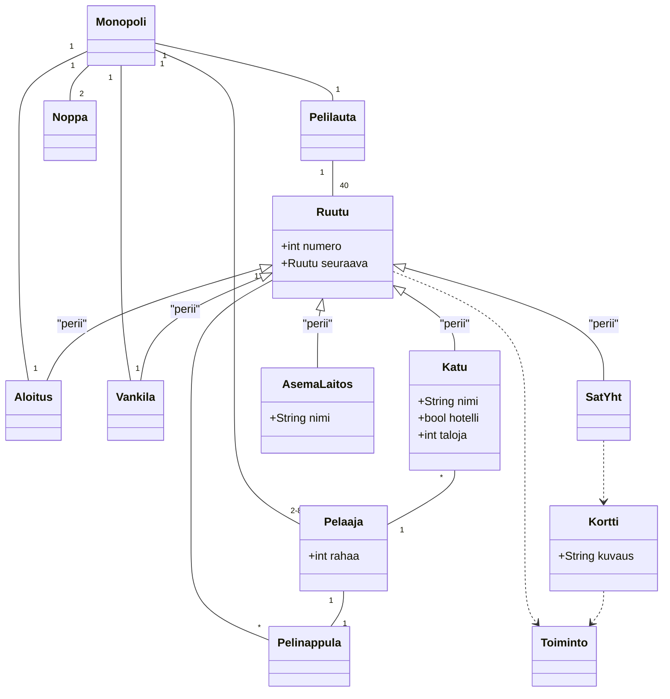

```mermaid
 classDiagram
     Monopoli "1" -- "1" Pelilauta
     Monopoli "1" -- "2-8" Pelaaja
     Monopoli "1" -- "2" Noppa
     Monopoli "1" -- "1" Aloitus
     Monopoli "1" -- "1" Vankila
     Pelilauta "1" -- "40" Ruutu
     Ruutu "1" -- "*" Pelinappula
     Pelaaja "1" -- "1" Pelinappula
     Ruutu ..> Toiminto
     Ruutu <|-- Vankila : "perii"
     Ruutu <|-- Aloitus : "perii"
     Ruutu <|-- SatYht : "perii"
     Ruutu <|-- Katu : "perii"
     Ruutu <|-- AsemaLaitos : "perii"
     Katu "*" -- "1" Pelaaja
     SatYht ..> Kortti
     Kortti ..> Toiminto
     class Monopoli{
     }
     class Pelaaja{
        +int rahaa
     }
     class Ruutu{
         +int numero
         +Ruutu seuraava
     }
     class Vankila{
     }
     class Aloitus{
     }
     class Katu{
        +String nimi
        +bool hotelli
        +int taloja
     }
     class AsemaLaitos{
        +String nimi
     }
     class SatYht{
     }
     class Kortti{
        +String kuvaus
     }
     class Toiminto{
     }
```
